# Foro Hub

Este es un proyecto interactivo en el que se puede realizar:
1) Registrar y eliminar Usuarios, a lo que genera un token de seguridad para la autenticacion
2) Registrar, actualizar, eliminar y listar cursos, como poder listarlos todos o solo por categoria 
4) Registrar, listar, actualizar y eliminar topicos, como también listarlos por fecha y nombre de curso 
5) Registrar, listar, actualizar y eliminar respuestas, como también maracarlas cuando están resueltas y cerradas

## Instalación

Para instalar el proyecto se necesita clonar el repositorio

```bash
  git clone https://github.com/OscarCuso/foro-hub
  cd foro-hub
```

## Uso del proyecto

Para iniciar el proyecto es necesario abrirlo desde un IDE, una vez abierto el proyecto lo podemos iniciar

Una vez iniciando el proyecto podemos hacer las pruebas o consultas en insomnia

Primero obtenemos una contraseña encriptada para mayor seguridad

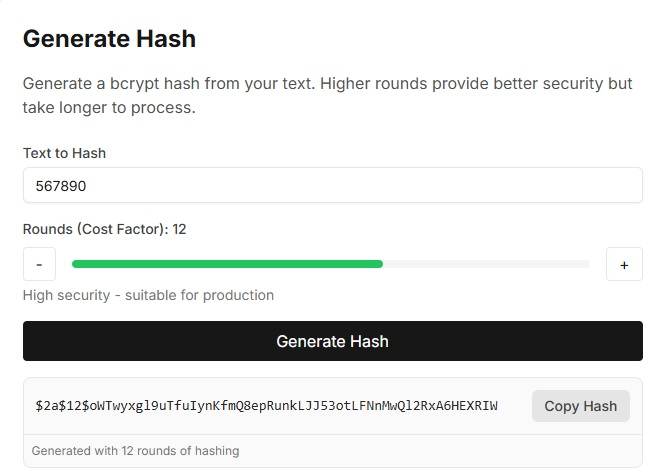

Después hacemos el registro de usuario donde nos piden los campos obligatorios de nombre, correo electronico, contraseña y perfil(solo es un campo como de nombre de perfil)

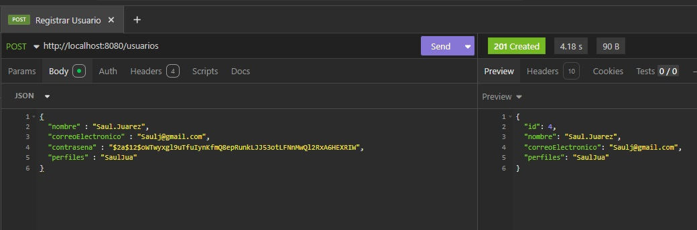

Procedemos a iniciar sesion donde nos pedira el nombre y la contraseña y nos generara un token con el que podemos hacer las consultas

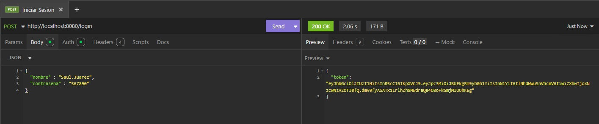

También podemos agregar los cursos donde ingresamos el nombre del curso y la categoria siendo solo 3 opciones(BACKEND, FRONTEND, DATABASE)
donde en cada consulta que hagamos tenemos que agregar el token generado en Auth, luego en Bearer Token y pegamos el token que nos dio cuando iniciamos sesion

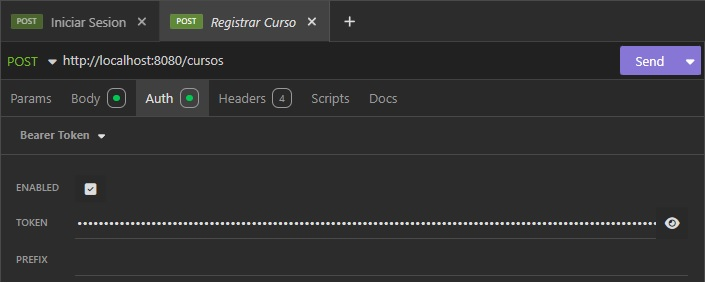

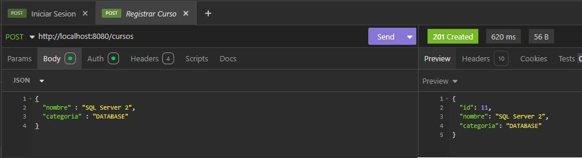

También podemos listar los cursos ingresados, y también listarlos por categoria 

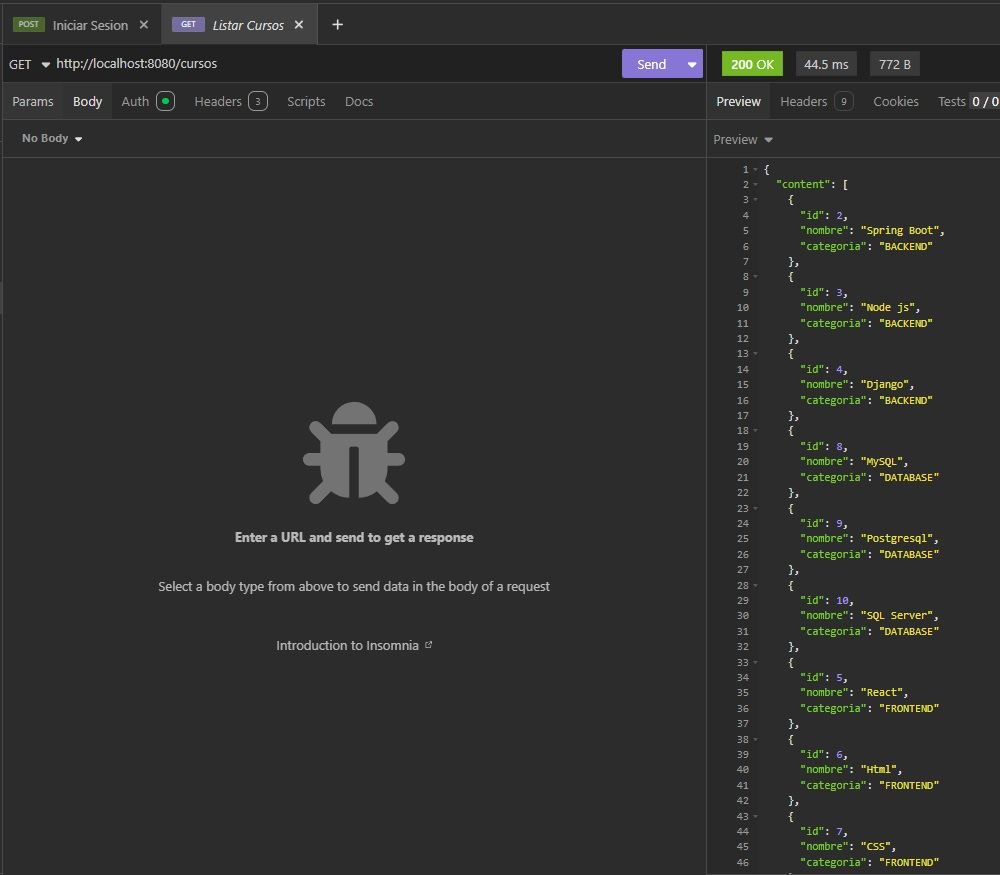

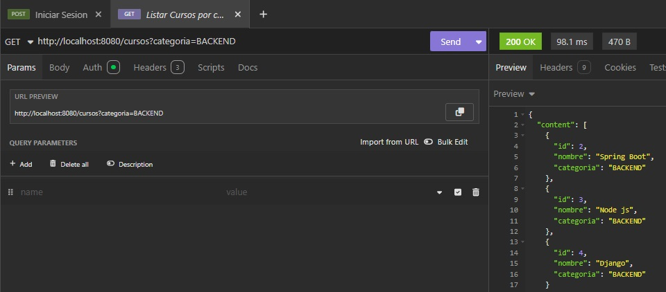

De igual manera podemos actualizar un curso ya sea como cambiar el nombre o la categoria, como también eliminarlo

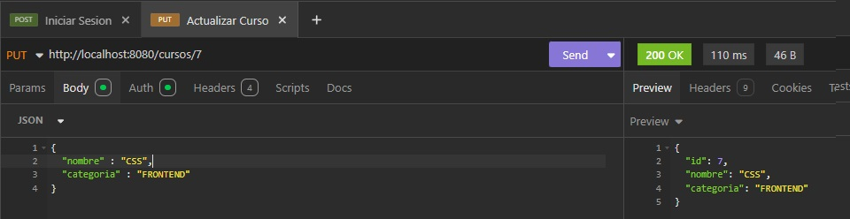

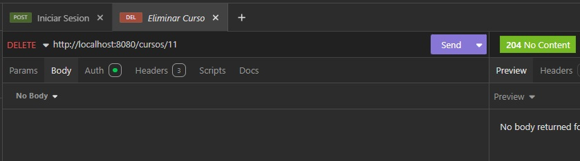

En los topicos igual podemos registrar, listar, actualizar, ver detalle de un topico y eliminar 

En registrar tenemos que ingresar un título y un mensaje como también él, id del curso al cual hace referencia 

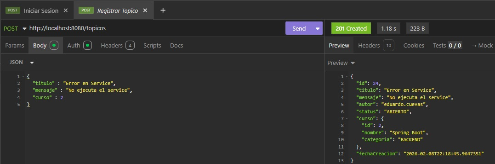

En listar nos mostrará los topicos creados, como también podemos listarlos por año de creacion y nombre de curso 

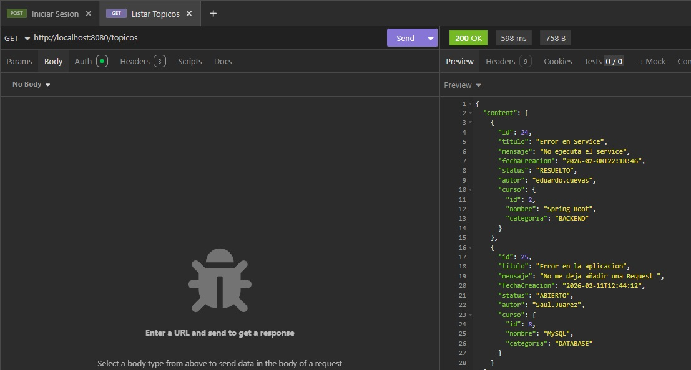

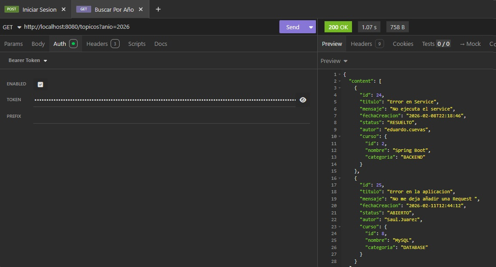

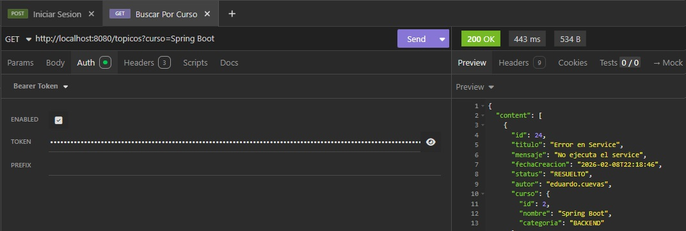

También podemos actualizar el topico en el título o mensaje o ambos seleccionando él, id del topico, como también mostar el detalle del topico y también eliminarlo

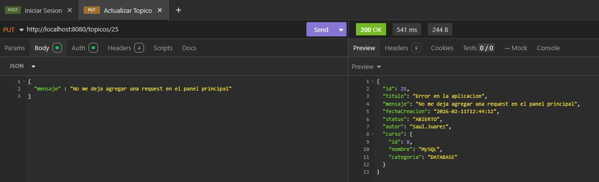

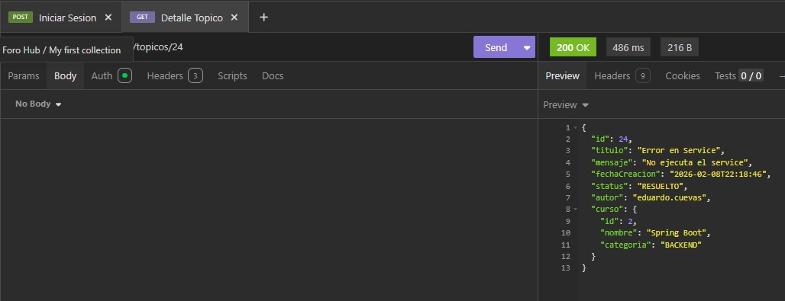

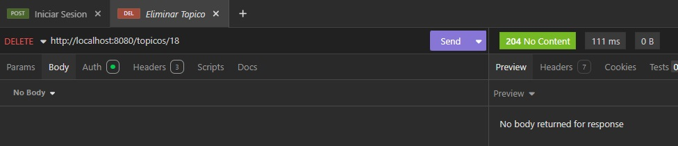

En las respuestas podemos registrarlas con él, id del topico al que hacemos referencia, y colocando el mensaje de la supuesta solucion

Donde la respuesta nos mostrara él, id de la respuesta el mensaje, la fecha y el autor, como los datos del topico como también los datos del curso

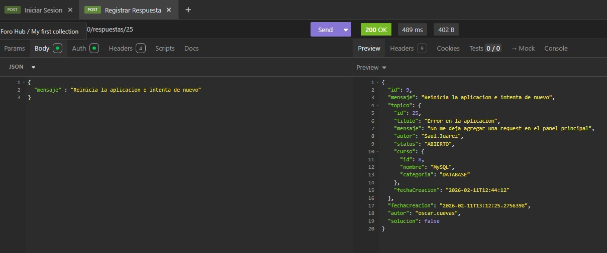

También podemos eliminar una respuesta 

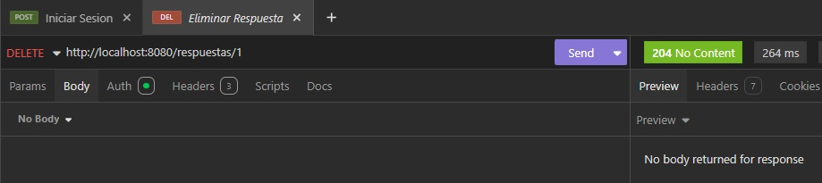

También podemos cambiar la solucion del topico si es que le sirvio la respuesta, pasaria de abierto ha resuelto, el que puede hacer ese cambio es solo el autor del topico

Donde la url debemos poner él, id del topico él, id de la respuesta y solucion ejemplo: (http://localhost:8080/topicos/24/respuestas/7/solucion)

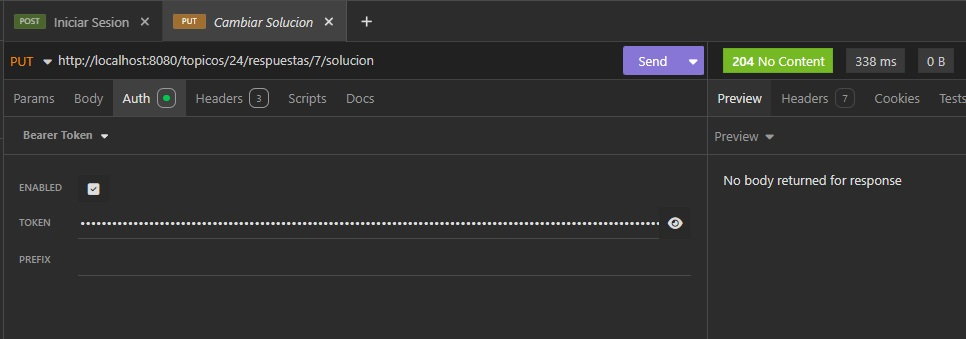

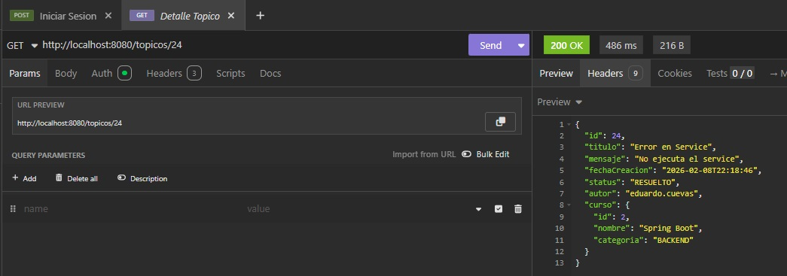

Si intentamos cerrar o cambiar el status con un usuario que no sea el que creo el topico no nos dejara 

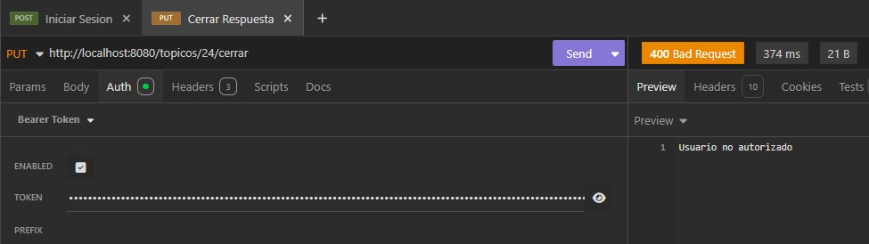

Y también podemos cambiar el status del topico a cerrado para que ya no se puedan anadir más respuestas a ese topico 

Solo necesitamos iniciar sesion con el usuario del topico y en la url añadir el topico y cerrar, ejemplo: (http://localhost:8080/topicos/24/cerrar)


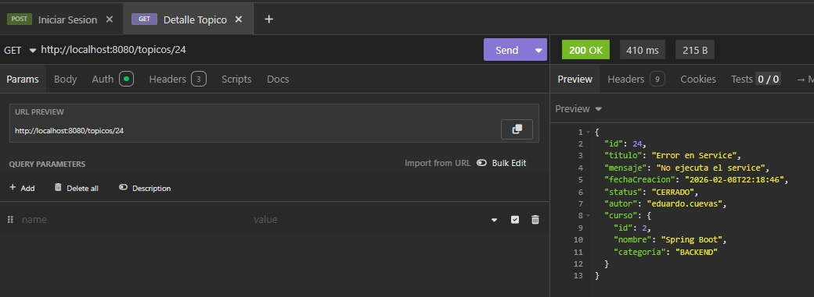

## Autores

- [@OscarCuso](https://github.com/OscarCuso)